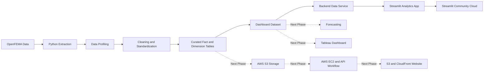

<div align="center">

# 🌪️ FEMA Disaster Intelligence Dashboard

**An end-to-end analytics project for exploring FEMA disaster declarations across time, geography, incident type, and FEMA region.**

[](https://disaster-intelligence-dashboard.streamlit.app/)


</div>

---

## 📌 Project Overview

The **FEMA Disaster Intelligence Dashboard** analyzes the OpenFEMA **Disaster Declarations Summaries v2** dataset to identify long-term trends, seasonal patterns, geographic hotspots, incident-type differences, and regional activity across the United States and its territories.

The project combines Python data preparation, a reusable backend data service, interactive Streamlit analytics, warehouse-style curated tables, and planned Tableau and AWS components.

### Research Question

> **How do FEMA disaster declarations change across time and location, and what patterns can be identified to improve planning and situational awareness?**

---

## 🚀 Live Dashboard

The public Streamlit application is available here:

### [Open the FEMA Disaster Intelligence Dashboard](https://disaster-intelligence-dashboard.streamlit.app/)

The dashboard supports interactive filtering, KPI updates, trend analysis, seasonality exploration, regional comparisons, and CSV downloads.

---

## ✨ Current Features

### Interactive Filters

- Declaration date range
- State or territory
- FEMA region
- Incident type
- Declaration type

### Key Performance Indicators

- Total declaration records
- Unique disaster numbers
- Top state or territory
- Top incident type
- Peak declaration year

### Analytics and Visualizations

- Annual declaration trends
- Monthly declaration trends
- Seasonal declaration patterns
- Incident-type comparisons
- State-level comparisons
- FEMA-region comparisons
- State and incident-type combinations
- Filtered declaration records table
- Downloadable CSV output

### Data Handling

- Local full-dataset support
- Official OpenFEMA CSV loading for hosted deployment
- Repository sample fallback
- Streamlit data caching
- Standardized date, location, incident, and declaration fields
- Separate metrics for declaration records and unique disasters

---

## 🧭 Project Status

| Phase | Status |
|---|---|
| Project planning and repository setup | ✅ Complete |
| FEMA data extraction | ✅ Complete |
| Data profiling and quality review | ✅ Complete |
| Data cleaning and derived fields | ✅ Complete |
| Curated fact and dimension tables | ✅ Complete |
| Initial descriptive analysis | ✅ Complete |
| Dashboard-ready dataset | ✅ Complete |
| Streamlit analytics application | ✅ Complete |
| Streamlit Community Cloud deployment | ✅ Complete |
| Forecasting component | 🔄 Next phase |
| Tableau dashboard | 🔄 Next phase |
| AWS S3 and EC2 integration | 🔄 Next phase |
| API-based AWS data workflow | 🔄 Next phase |
| Public AWS-hosted project website | 🔄 Next phase |
| Final report and presentation | ⏳ Planned |

---

## 🏗️ Architecture



---

## 🗂️ Repository Structure

```text
Disaster_Intelligence_Dashboard/
├── .streamlit/
│   └── config.toml
├── analytics/
│   ├── scripts/
│   │   ├── 01_fetch_fema_data.py
│   │   ├── 02_profile_data.py
│   │   ├── 03_clean_data.py
│   │   ├── 04_create_curated_tables.py
│   │   ├── 05_initial_analysis.py
│   │   └── 06_create_dashboard_dataset.py
│   └── streamlit/
│       └── app.py
├── backend/
│   ├── __init__.py
│   └── fema_data_service.py
├── data/
│   ├── raw/
│   ├── cleaned/
│   ├── curated/
│   └── sample/
├── docs/
├── frontend/
├── infrastructure/
├── screenshots/
├── requirements.txt
├── README.md
└── LICENSE
```

---

## ⚙️ Data Pipeline

Run the scripts from the repository root in this order:

```bash
python analytics/scripts/01_fetch_fema_data.py
python analytics/scripts/02_profile_data.py
python analytics/scripts/03_clean_data.py
python analytics/scripts/04_create_curated_tables.py
python analytics/scripts/05_initial_analysis.py
python analytics/scripts/06_create_dashboard_dataset.py
```

### Script Summary

| Script | Purpose |
|---|---|
| `01_fetch_fema_data.py` | Downloads FEMA disaster declaration data and creates a review sample. |
| `02_profile_data.py` | Profiles columns, missing values, record counts, states, incident types, and years. |
| `03_clean_data.py` | Standardizes fields, converts dates, removes exact duplicates, and creates time features. |
| `04_create_curated_tables.py` | Builds the fact table and supporting date, location, and incident-type dimensions. |
| `05_initial_analysis.py` | Produces summary outputs for trends, states, regions, incident types, and combinations. |
| `06_create_dashboard_dataset.py` | Creates the flattened dataset used by Streamlit and future dashboard development. |

---

## 💻 Run Streamlit Locally

### Windows PowerShell or VS Code Terminal

```powershell
python -m venv .venv
Set-ExecutionPolicy -Scope Process -ExecutionPolicy Bypass
.\.venv\Scripts\Activate.ps1
python -m pip install --upgrade pip
python -m pip install -r requirements.txt
python -m streamlit run analytics/streamlit/app.py
```

Open the local app at:

```text
http://localhost:8501
```

Stop the server with:

```text
Ctrl + C
```

### macOS or Linux

```bash
python -m venv .venv
source .venv/bin/activate
python -m pip install --upgrade pip
python -m pip install -r requirements.txt
python -m streamlit run analytics/streamlit/app.py
```

---

## 🔄 Data Loading Strategy

The Streamlit application uses the first available source in this order:

1. Local dashboard dataset
2. Local cleaned dataset
3. Local raw dataset
4. Official OpenFEMA CSV
5. Repository sample dataset

This approach supports local development, hosted deployment, and a working fallback when a full local file is unavailable.

---

## 🧱 Backend Data Service

The `backend/fema_data_service.py` module handles the shared data operations used by the Streamlit application, including:

- Locating the best available dataset
- Loading local or remote FEMA data
- Standardizing text and date fields
- Creating dashboard-ready fields
- Applying user-selected filters
- Sorting FEMA region labels
- Returning source and sample-status information

A separate web server is not required for the current Streamlit phase. The application imports the backend service directly.

---

## 📊 Data Interpretation

Dashboard totals count **declaration records** unless a metric specifically identifies **unique disaster numbers**.

One FEMA disaster number may appear in multiple records because separate counties, tribal areas, parishes, municipalities, or other designated areas can be listed individually. Declaration totals should therefore not be interpreted as a direct count of separate disaster events.

---

## ⚠️ Limitations

- FEMA declarations are administrative records and do not measure every disaster occurrence.
- Multiple records may be connected to one disaster number.
- Declaration volume does not directly measure disaster severity or financial impact.
- Some optional fields contain missing values.
- Historical declaration patterns do not guarantee future disaster activity.
- Future forecasting results will estimate declaration-record volume, not predict individual disasters.

---

## ☁️ Next Phase

The next development phase will focus on:

- Building a lightweight monthly forecasting component by FEMA region
- Expanding the Tableau dashboard with maps, trends, seasonality, and hotspot analysis
- Creating AWS S3 storage for raw, cleaned, curated, dashboard, forecast, website, and log files
- Configuring AWS EC2 for pipeline execution
- Building an API-based workflow for repeatable AWS data updates
- Replacing the starter frontend with the completed project website
- Hosting the public website through Amazon S3 and CloudFront
- Completing final testing, documentation, and presentation materials

---

## 📚 Documentation

Additional project documentation is available in the `docs/` folder:

- `data_profile_summary.md`
- `cleaned_data_summary.md`
- `curated_data_model_summary.md`
- `initial_analysis_summary.md`
- `dashboard_data_dictionary.md`
- `streamlit_deployment.md`

---

## 🗃️ Data Source

**FEMA OpenFEMA — Disaster Declarations Summaries v2**

- Dataset page: `https://www.fema.gov/openfema-data-page/disaster-declarations-summaries-v2`
- API endpoint: `https://www.fema.gov/api/open/v2/DisasterDeclarationsSummaries`

The project uses publicly available FEMA data for educational and analytical purposes.

---

## 📄 License

This project is licensed under the [MIT License](LICENSE).
